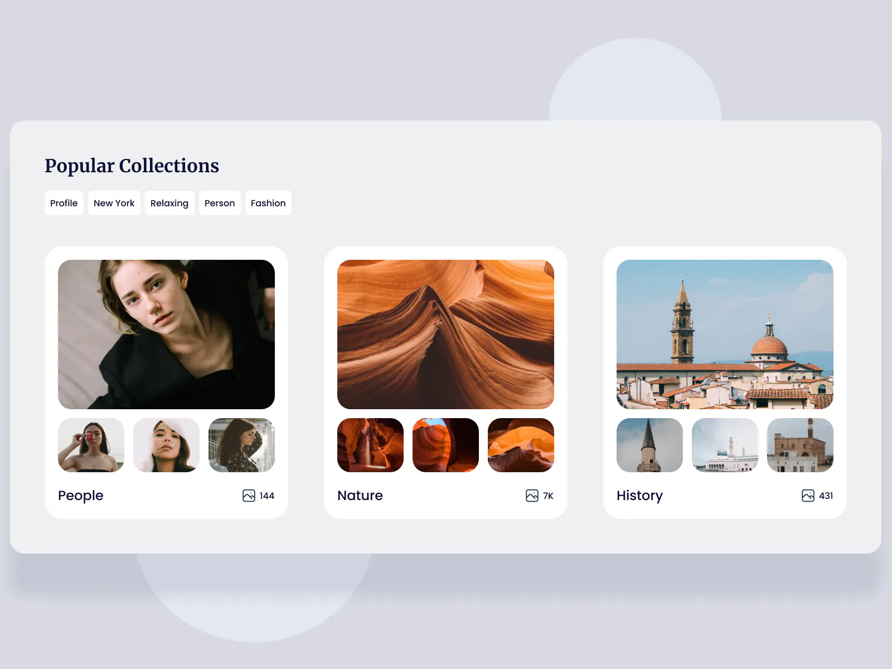

import { CollectionsList } from './collections-list';

# 100 Days of Code 2: Collections List

Alright, let's make this today:

Like yesterday, this challenge is from [ICodeThis](https://icodethis.com/modes/design-to-code/58/submissions).

<CollectionsList />
 
Gorgeous! We even got the background to look pretty identical. Now, here's a
CodeSandbox of the component for you to play with if you want to check out the
code yourself:

<iframe
  src='https://codesandbox.io/embed/wftwsy?view=Editor+%2B+Preview&module=%2Fsrc%2Fcollections-list.tsx'
  style={{
    width: '100%',
    height: '500px',
    border: '0',
    borderRadius: '4px',
    overflow: 'hidden',
  }}
  title='collections-list'
></iframe>
