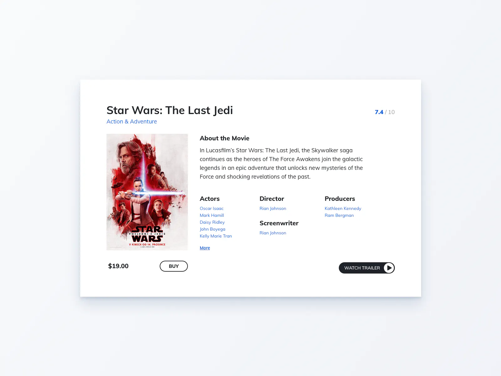

import { MovieCard } from './movie-card';

# 100 Days of Code 3: Movie Card

Here's what we're making today:

{/* truncate */}

The challenge is from [ICodeThis](https://icodethis.com/modes/design-to-code/57/submissions).

& bada-boom:

<MovieCard />
 
As per usual, the text is super weird to figure out, but I'm generally happy
with the result. Figuring out text is something Figma is usually good at, I
figure, but I don't know how to use Figma.

Come to think of it, why am I able to code this so easily, but not just use
Figma to make a mock-up? I should use these exercises as an opportunity to learn
graphic design! I'll do that tomorrow, I think.

& here's the CodeSandbox:

<iframe
  src='https://codesandbox.io/embed/xpkny3?view=Editor+%2B+Preview&module=%2Fsrc%2Fmovie-card.tsx'
  style={{
    width: '100%',
    height: '500px',
    border: '0',
    borderRadius: '4px',
    overflow: 'movie-card',
  }}
  title='movie-card'
></iframe>
