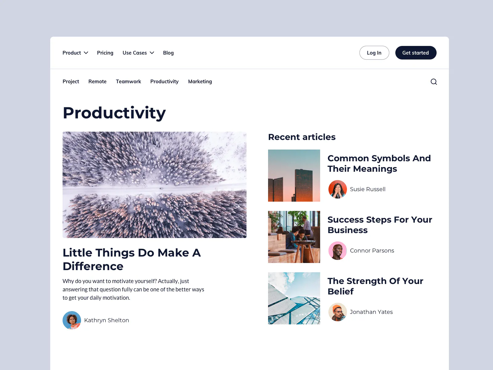

import { ArticlePage } from './article-page';
import './styles.css';

# 100 Days of Code 4: Article Page

Okay, here's what we're making today:

{/* truncate */}

As per usual, the challenge is from [ICodeThis](https://icodethis.com/modes/design-to-code/49/submissions).

& today I want to do this differently. Before I code it, I want to make a
mock-up in Figma. Then, I can theoretically use that mock-up as a design
reference far more easily than I can the image ICodeThis provides. Plus, it will
get me one step closer to being able to design my projects in Figma first, then
in code second. Currently, I'm stuck having to design + code at the same time. &
that's like... way, way harder than it needs to be. I don't how to use Figma,
but hopefully this will only be super hard the first time.

Without further ado, here's my Figma mock-up:

<iframe
  style={{
    border: '1px solid rgba(0, 0, 0, 0.1)',
  }}
  width='100%'
  height='450'
  src='https://www.figma.com/embed?embed_host=share&url=https%3A%2F%2Fwww.figma.com%2Ffile%2F39ABvxaO36tLLFcjxfwMac%2F100-Days-of-Coding-4%253A-Article-Page%3Ftype%3Ddesign%26node-id%3D0%253A1%26mode%3Ddesign%26t%3DDgFcw7zvSsz33GUf-1'
  allowFullScreen
></iframe>
 
It is legitimately hilarious that the nature of this blog makes it seem like I just
went from "I don't know how to use Figma!" to "Here's a competent mock-up in Figma."
In literally one sentence, as if I didn't just spend hours reading Figma docs & messing
around with random crap until I learned enough to make that mockup.

BUT, either way, I'm pleased with it looks. Now, let's code it up! So at this point
we're basically just at the start of where we'd be normally, but now instead of arbitrarily
throwing text styles into element tags, I can actually use the more consistent styles
I made in Figma. Biiig perk of being able to use Figma.

Now the fun part is more configuration detours! Because I want each of these challenges
to be self-contained, I'm going to have to figure out how to use separate Tailwind
configs for each one. & the best for you, is that you don't need to do any of the
research or feel any time pass at all because I'm just gonna stop typing & do the
research myself right now until something works.

**Okay,** I think we've got it. Tailwind has a neat directive, `@config`, that you
can throw in a `.css` file that will let you use a different config file for that
specific file. So I can just make a new base `styles.css` file & a new `tailwind.config.ts`
file for each challenge, throw in the `@config` directive in that base `styles.css`
file pointing to that project's `tailwind.config.ts` file, & then abra-kadabra now
I can use a different Tailwind config for each challenge.

Looks like it's working! Okay, configuration detour over. Now let's actually code this thing up.

<ArticlePage />
 & done! That was a very interesting process. I still used those cartoon avatars
because I hate searching for images in general, & DiceBear seems to make generate
decent avatars on-the-fly. I feel like this was simpler than the last one yet it
took a lot more work given the amount of configuration detours & incorporating a
new tool (Figma) for protyping. But this was the first time I've put legitimate thought
into fonts, so that's cool!

One last catch is that the example image was designed for desktop, & I'm sure there's
some standardized way to make it responsive, but I'm not sure what that is yet. So
in the meantime, I just straight up coded this like normal & then put in the CSS
to scale the whole thing down to 60% so that it would fit on the screen here but
not end up squishing the content to a mobile size. So I'll just leave it as is for
now. I'm sure I'll learn how to make stuff like that responsive eventually.

Anyway, for today here's the CodeSandbox of it. Turns out configuring Tailwind was
even more of a pain here than last time because of the additional theme customizations,
but maybe tomorrow I'll do this without using the `@components` layer.

<iframe
  src='https://codesandbox.io/embed/nfgh6z?view=editor+%2B+preview&module=%2Fsrc%2Farticle-page.tsx'
  style={{
    width: '100%',
    height: '500px',
    border: '0',
    borderRadius: '4px',
    overflow: 'hidden',
  }}
  title='article-page'
></iframe>
