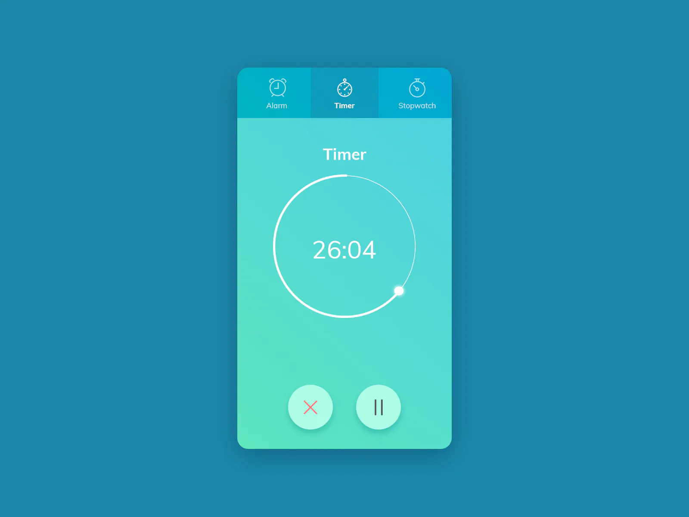

import { Timer } from './timer';

# 100 Days of Code 5: Timer

Something a little simpler today, because I have spent the day working on a different project.

{/* truncate */}

[**Challenge from ICodeThis**](https://icodethis.com/modes/design-to-code/54/submissions)

Ironically I'm not really sure why I'd need to do this anyway because I'm already coding something else today, but I like the idea of having a deliverable every day.

& we'll continue the trend of mocking it up in Figma first to get the styles right visually before we start coding.

Mockup:

<iframe
  style={{
    border: '1px solid rgba(0, 0, 0, 0.1)',
  }}
  width='100%'
  height='450'
  src='https://www.figma.com/embed?embed_host=share&url=https%3A%2F%2Fwww.figma.com%2Ffile%2FtNxTN2jcCei2U5igC8sfAc%2F100-Days-of-Code-5%253A-Timer%3Ftype%3Ddesign%26node-id%3D0%253A1%26mode%3Ddesign%26t%3Dz544cBlCT6LXKHEo-1'
  allowFullScreen
></iframe>
 
Okay, now time to code!

<Timer />
 
It is actually wild to me how easily & precisely I can take a design from Figma
& turn it into code. The novelty will probably become mundane soon, but for the
time being it's just crazy that I can mock stuff up in Figma, think "alright,
close enough" & then just plug in all the values for fonts & spacing into the
code here & it looks more or less exactly the same on the first try. Lemme tell
ya, I could get used to THAT.

I probably could have added an actual count to this timer, but to be honest it's 2am & I just don't feel like it. Deliverables at all costs, baby!

Last but not least, here's a CodeSandbox version of the timer that's mostly the same but with some minor font + color differences:

<iframe
  src='https://codesandbox.io/embed/g4lzr3?view=editor+%2B+preview&module=%2Fsrc%2Ftimer.tsx'
  style={{
    width: '100%',
    height: '500px',
    border: '0',
    borderRadius: '4px',
  }}
  title='timer'
></iframe>
