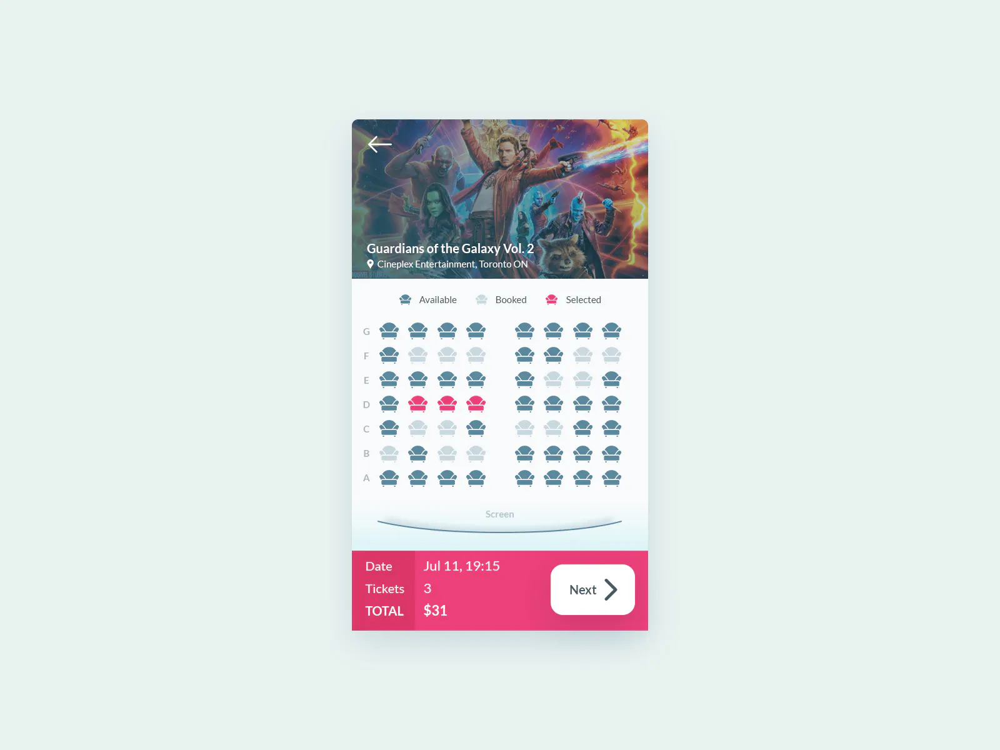

import { FigmaEmbed } from '@site/lib/figma-embed';
import { MovieTicket } from './movie-ticket';

# 100 Days of Code 6: Movie Ticket

Let's do a more complicated one today. Here's the prompt:

{/* truncate */}

[**Challenge from ICodeThis**](https://icodethis.com/modes/design-to-code/64/submissions)

Okay, let's start with a mockup in Figma:

<FigmaEmbed url='https://www.figma.com/embed?embed_host=share&url=https%3A%2F%2Fwww.figma.com%2Ffile%2FQrKIAN97UZsjVjl5m8BnDD%2F100-Days-of-Code-6%253A-Movie-Ticket%3Ftype%3Ddesign%26node-id%3D0%253A1%26mode%3Ddesign%26t%3DUoAhHI6udkjm3TYn-1' />
 
Okay, now time to code!

<MovieTicket />
