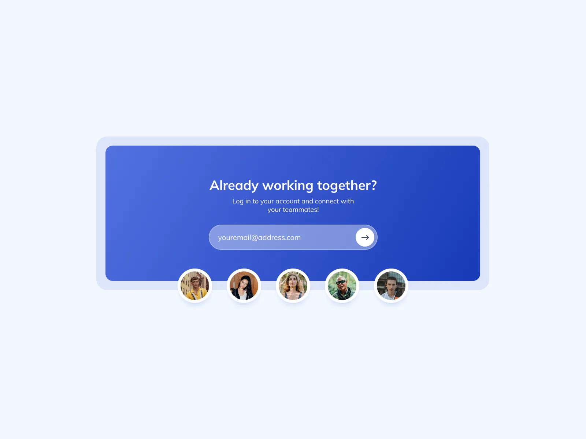

import { FigmaEmbed } from '@site/lib/figma-embed';
import { CodeSandboxEmbed } from '@site/lib/code-sandbox-embed';
import { SocialLogin } from './social-login';

# 100 Days of Code 7: Social Login

Here's the prompt for today:

{/* truncate */}

[Challenge from ICodeThis](https://icodethis.com/modes/design-to-code/45/submissions)

& this time, we'll time it. Just for fun, we'll time the Figma portion separately from the coding portion.

Figma mockup, time starts now!

<FigmaEmbed url='https://www.figma.com/embed?embed_host=share&url=https%3A%2F%2Fwww.figma.com%2Ffile%2FlQeHXso98MJKeXFbK20ptB%2F100-Days-of-Coding-7%253A-Social-Login%3Ftype%3Ddesign%26node-id%3D0%253A1%26mode%3Ddesign%26t%3DBdwadwAIuWso2AUw-1' />
 
Mockup done! Looks like 31 minutes. Seems passable I guess, but I definitely
lost a lot of time with little things you can easily do in code that I don't
have a clear analogue for in Figma, such as those dots as the bottom. In code
I'd just set the alignment to be the bottom of the container & then give them a
negative margin to move them down, but Figma doesn't seem to have that. Figma
not letting you set margins in general is pretty annoying, but it's still a good
software.

Okay, let's see if I can finish the code in time to still fit in a bike ride while the sun is out. Fortunately it's the summer so 4pm is still pretty bright.

Coding time starts now!

<SocialLogin />
 
Done! Looks like it was 38 minutes. Not super stoked about that. When I started
going I had the horrible realization that I had, once again, chosen extremely
small fonts so I hda to arbitarily resize some stuff to make the font looks
readable without needing to zoom in. It is comical how bad I am at fonts.

Also, turns out you can't put children inside of an `<input />` tag? How have I never come across this before? Either way, it wasted a decent chunk of time having to work around that.

Either way, not stoked but not super disappointed! I like the idea of speed-coding these, especially because I'm working on some big projects outside of this so it incentivizes me to be efficient with my time without just saying "screw it" like I may have done yesterday.

I swear I spent all day coding, I just didn't necessarily have a deliverable!

Now let's end this challenge with a CodeSandbox for you to check out:

<CodeSandboxEmbed
  title='social-login'
  url='https://codesandbox.io/embed/p4f5gt?view=preview+%2B+preview&module=%2Fsrc%2Fsocial-login.tsx'
/>
