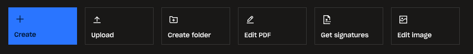
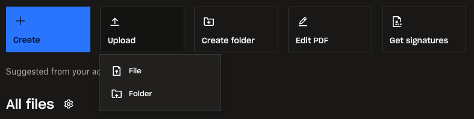
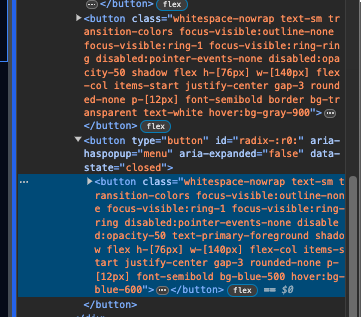

## 1. Set up Next.js (v14 at time of writing)

- `pnpm dlx create-next-app@latest`
  - we use pnpm because I like it, but this can all be done with npm as well
  - app name: fallcrate-tutorial
  - use Typescript (because type-safety ftw)
  - use eslint (just because)
  - use TailwindCSS (because it's amazing)
  - use /src (because it nicely separates configs from code)
  - use app router (because it's cool)
  - use default alias (because I don't have a good reason to the contrary)
- sanity check
  - `pnpm dev`
  - check http://localhost:3000
  - it runs, yay!
- replace homepage with, like, anything

  ```tsx
  // src/app/page.tsx
  export default function Home() {
    return (
      <main className='flex min-h-screen flex-col items-center justify-between p-24'>
        If you can&apos;t tell the difference between a spoon and a ladle, then
        you&apos;re fat
      </main>
    );
  }
  ```

  - side note: we use `&apos;` for apostrophes because of sanitized inputs or something
  - check that the changes are reflected - yay, they are

- now is a bit of a personal choice: we're going to mock layouts before we actually plug in any infrastructure
  - this should make it a little less intimidating
  - it does come at the cost of having to configure dependencies in a slightly more complex codebase, but it shouldn't be too bad
  - I will also include installation of dependencies in a fresh project in a separate section for those who want to do it that way
- create new route for layout testing

  - this is one reason why the app router is very nice, creating new routes just to test stuff is braindead simple
  - create `src/app/test/page.tsx`

    - you can either create a file in `src/app` named `test/page.tsx` or you can manually create the `test` directory & then the `page.tsx` file, these are equivalent but the first option is a shortcut
    - make `page.tsx` a default export filler component:

    ```tsx
    // src/app/test/page.tsx
    import React from 'react';

    const Page = () => {
      return (
        <div>
          They say that money talks, but all mine says is &apos;Goodbye!&apos;
        </div>
      );
    };

    export default Page;
    ```

    - sanity check: view the route at `/test`

## 2. Design time, I guess?

- Pull up actual Dropbox - this provides 2 advantages:

  - A quick template we can copy on desktop
  - Automatic reference for responsive design

- Pick the most obvious page division to start at - I first notice the sidebar + main content division
- Let's create that division (in the test route, just to keep it sandboxed):

  - step 1, put borders on things
  - step 2, notice that the content is not as big as you thought it was & investigate

    - the fix: make the `body` tag h-screen (needs to be h-screen instead of min-h-screen so that h-full works in its children, it's a quirk of CSS height)

    ```tsx
    // src/app/layout.tsx
    import type { Metadata } from 'next';
    import { Inter } from 'next/font/google';
    import './globals.css';

    const inter = Inter({ subsets: ['latin'] });

    export const metadata: Metadata = {
      title: 'Create Next App',
      description: 'Generated by create next app',
    };

    export default function RootLayout({
      children,
    }: Readonly<{
      children: React.ReactNode;
    }>) {
      return (
        <html lang='en'>
          <body className={`${inter.className} h-screen`}>{children}</body>
        </html>
      );
    }
    ```

    - we're using string interpolation for now, which I despise, but we'll fix that later when we install a dependency (shadcn-ui)
    - now any child can have h-full & it'll adapt to the screen height

    ```tsx
    // src/app/test/page.tsx
    import React from 'react';

    const Page = () => {
      return (
        <div className='border h-full'>
          They say that money talks, but all mine says is &apos;Goodbye!&apos;
        </div>
      );
    };

    export default Page;
    ```

    - & now the content size looks as it should

  - step 3, actually create the containers
    - Still using Dropbox as a reference
    - Make sure to 'inspect element' to check sizes & colors when necessary
    - Sidebar appears to be 240px - use the `w-[240px]` class
    - Main content fills remaining width - use the `flex-1` class

- Now, time to make ui components - shadcn/ui to the rescue

## 3. Set up shadcn/ui

- what is shadcn/ui? It is a set of component primitives built on Radix-ui, TailwindCSS & class-variance-authority designed to make crafting custom components way, way faster whilst also being accessibility-friendly
- VERY IMPORTANT POINT: do NOT treat the primitives it provides as gospel, they are meant to be easily modified
- We will, in fact, be changing them & in some cases going under-the-hood to leverage Radix-ui when shadcn/ui makes architectural choices I don't personally agree with. But I will ensure you very deeply understand my rationale when this happens.
- go to https://ui.shadcn.com/
- navigate to /docs/installation/next & check the tutorial:

  1. We skip this, we already have a Next.js project set up
  2. Run the cli, but for pnpm (sorry, I like pnpm): `pnpm dlx shadcn-ui@latest init`
  3. Answer the prompts to configure `components.json`, which is basically shadcn/ui's configuration file used when adding a new component - there are reasons to touch this, but for this project we will not need to
     - `Which style would you like to use? › New York` (literally just because I like it slightly more than default)
     - `Which color would you like to use as base color? › Slate` (because I don't care about colors)
     - `Do you want to use CSS variables for colors? › yes` (because CSS variables are cool, even though we won't really do anything cool with them)
  4. Optionally, use shadcn/ui's configuration for font in `/src/app/layout.tsx` - not really a big deal, but it seems like a good way to set it up & it shows you how we can replace the string interpolation with the new `cn` utility we can now use.

     - here we incorporate shadcn/ui's code with our own:

     ```tsx
     // src/app/layout.tsx
     import type { Metadata } from 'next';
     import { Inter as FontSans } from 'next/font/google';
     import { cn } from '@/lib/utils';
     import '@/app/globals.css';

     const fontSans = FontSans({
       subsets: ['latin'],
       variable: '--font-sans',
     });

     export const metadata: Metadata = {
       title: 'Create Next App',
       description: 'Generated by create next app',
     };

     export default function RootLayout({
       children,
     }: Readonly<{
       children: React.ReactNode;
     }>) {
       return (
         <html lang='en'>
           <body
             className={cn(
               'h-screen bg-background font-sans antialiased',
               fontSans.variable
             )}
           >
             {children}
           </body>
         </html>
       );
     }
     ```

  - also we make sure to incorporate the font-family into our tailwind.config.ts:

  ```ts
  // tailwind.config.ts
  import type { Config } from 'tailwindcss';
  import { fontFamily } from 'tailwindcss/defaultTheme';

  const config = {
    darkMode: ['class'],
    content: [
      './pages/**/*.{ts,tsx}',
      './components/**/*.{ts,tsx}',
      './app/**/*.{ts,tsx}',
      './src/**/*.{ts,tsx}',
    ],
    prefix: '',
    theme: {
      container: {
        center: true,
        padding: '2rem',
        screens: {
          '2xl': '1400px',
        },
      },
      extend: {
        fontFamily: {
          sans: ['var(--font-sans)', ...fontFamily.sans],
        },
        colors: {
          border: 'hsl(var(--border))',
          input: 'hsl(var(--input))',
          ring: 'hsl(var(--ring))',
          background: 'hsl(var(--background))',
          foreground: 'hsl(var(--foreground))',
          primary: {
            DEFAULT: 'hsl(var(--primary))',
            foreground: 'hsl(var(--primary-foreground))',
          },
          secondary: {
            DEFAULT: 'hsl(var(--secondary))',
            foreground: 'hsl(var(--secondary-foreground))',
          },
          destructive: {
            DEFAULT: 'hsl(var(--destructive))',
            foreground: 'hsl(var(--destructive-foreground))',
          },
          muted: {
            DEFAULT: 'hsl(var(--muted))',
            foreground: 'hsl(var(--muted-foreground))',
          },
          accent: {
            DEFAULT: 'hsl(var(--accent))',
            foreground: 'hsl(var(--accent-foreground))',
          },
          popover: {
            DEFAULT: 'hsl(var(--popover))',
            foreground: 'hsl(var(--popover-foreground))',
          },
          card: {
            DEFAULT: 'hsl(var(--card))',
            foreground: 'hsl(var(--card-foreground))',
          },
        },
        borderRadius: {
          lg: 'var(--radius)',
          md: 'calc(var(--radius) - 2px)',
          sm: 'calc(var(--radius) - 4px)',
        },
        keyframes: {
          'accordion-down': {
            from: { height: '0' },
            to: { height: 'var(--radix-accordion-content-height)' },
          },
          'accordion-up': {
            from: { height: 'var(--radix-accordion-content-height)' },
            to: { height: '0' },
          },
        },
        animation: {
          'accordion-down': 'accordion-down 0.2s ease-out',
          'accordion-up': 'accordion-up 0.2s ease-out',
        },
      },
    },
    plugins: [require('tailwindcss-animate')],
  } satisfies Config;

  export default config;
  ```

  - Sanity check, look back at http://localhost:3000/test
    - it is still structured correctly but the colors aren't right any more, but that's fine because we simply are using light mode by default. To switch to dark mode, we add the `dark` class to the `html` tag.
    - From here on out, we'll be modifying dark mode CSS variables (when we need to) since we're using dark mode

  5. Ignore this, it's more of a recommendation & we're largely following it already. globals.css isn't in the `styles` directory, but I don't care
  6. We're done! We can now add components. Time to start building.

## 4. Start building random stuff (this will be very large)

### The browse-action-bar


Why are we calling it that? Because Dropbox called it that. Why did Dropbox call it that? I don't know, I don't work at Dropbox. If they're hiring I wouldn't say no, though.

First, however, we have to think about some of the design choices made here. For instance, the 'Create' button. It's the primary call-to-action button of the menu, but if we click on it, we see that it doesn't do anything that is both relevant to file uploads & non-redundant to the 'Upload' button right next to it. The features it advocates for are outside of the scope of this project & as such, we will remove it.

Since the primary feature of this app is document uploads rather than document creation, we will actually make the primary call-to-action button the 'Upload' button instead.

Shadcn/ui has some tools to make creating these buttons easier, but we will still need to customize it. We'll start by adding the Button primitive from the command line in the root of the project:

`pnpm dlx shadcn-ui@latest add button`

Cool, now we have a Button primitive we can extend + customize in `src/components/ui/button.tsx`. However, as we make more components on top of shadcn/ui primitives, we will throw them outside of the `ui` folder in the `src/components` folder to distinguish between component primitives & components. So, we'll start with the browse-action-bar buttons.

Here it's important to note that we are using a shortcut from the react snippets VSCode extension. Specifically, `rafc` to create a React component that is exported as a named export. I've seen most projects that use default exports for components, & I just don't like that for no particular reason so I don't do it. I make an exception for app router pages, but that's because Next.js kinda forces me to because it displays the page as whatever the default export from `page.tsx` is.

Anyway, here's our starter button:

```tsx
// src/components/browse-action-bar-button.tsx
import React from 'react';

export const BrowseActionBarButton = () => {
  return <div>BrowseActionBarButton</div>;
};
```

I know, it's almost scary how advanced this code is.

Side note: You may be familiar with most React projects + tutorials that use PascalCase for component filenames. I do NOT use PascalCase for component filenames. I use kebab-case. This is literally just because MacOS is dumb & the filesystem in git is case-insensitive for filenames which means if I change `App.tsx` to `app.tsx`, git does not think anything has changed & the Github repo end up not matching with my local filesystem any time I change the case of a filename. It's a big headache so to get around this, I've just decided capital letters are banned from filenames in my projects now. Of course, with some obvious exceptions for things that are expected to be a particular case like `README.md` or `Dockerfile`. But if it's at all a stylistic choice, then I use exclusively kebab-case for filenames.

Anyway, let's make a button!

We'll start with the default Button primitive. & remember, we're temporarily using borders around stuff just because I like seeing them when I'm in the middle of development. We remove the borders when we feel confident we don't need them anymore.

Alright, here's a quick sanity check for putting a button in there.

```tsx
// src/app/test/page.tsx
import { BrowseActionBarButton } from '@/components/browse-action-bar-button';
import React from 'react';

const Page = () => {
  return (
    <div className='border-4 border-blue-600 flex h-full'>
      <div className='border-4 w-[240px]'>SIDEBAR</div>
      <div className='border-4 flex-1 flex-col'>
        <div className='border border-blue-500 flex'>
          <BrowseActionBarButton>Hey yo</BrowseActionBarButton>
        </div>
        MAIN CONTENT
      </div>
    </div>
  );
};

export default Page;
```

```tsx
// src/components/browse-action-bar-button.tsx
import React from 'react';
import { Button } from '@/components/ui/button';

type Props = {
  children: React.ReactNode;
};
export const BrowseActionBarButton = ({ children }: Props) => {
  return <Button>{children}</Button>;
};
```

Great, now we have a completely ill-matching button on the page. But it's OUR completely ill-matching button on the page.

Side note: We're gonna end up having to import stuff from `@/components/ui` a LOT, so to add just a bit more convenience let's create an alias for `@/components/ui`. As you can see, we're already using an alias for `src` because `@` is not actually a file path. So if we look where `@` is defined as the alias for the `src` directory, we can just add another alias for the `src/components/ui` (aka `@/components/ui`) directory.

#### Creating an alias:

We can see the alias for `src` configured in the `tsconfig.json` file:

```ts
{
  "compilerOptions": {
    "lib": ["dom", "dom.iterable", "esnext"],
    "allowJs": true,
    "skipLibCheck": true,
    "strict": true,
    "noEmit": true,
    "esModuleInterop": true,
    "module": "esnext",
    "moduleResolution": "bundler",
    "resolveJsonModule": true,
    "isolatedModules": true,
    "jsx": "preserve",
    "incremental": true,
    "plugins": [
      {
        "name": "next"
      }
    ],
    "paths": {
      "@/*": ["./src/*"]
    }
  },
  "include": ["next-env.d.ts", "**/*.ts", "**/*.tsx", ".next/types/**/*.ts"],
  "exclude": ["node_modules"]
}
```

So we can see right there in the `paths` field of the `compilerOptions` object that `@/*` is defined as the alias for `./src/*`. Here, the wildcard (`*`) just means 'we don't care what comes after this, just replace any path that starts with `@/` with `./src/` when compilation is happening.' It's something that affects literally no one but the coder, & I love it because I am the coder & it therefore affects me. Now, let's add another alias, but this time for the `./src/components/ui/` directory because I don't want to keep typing that every time I reference a ui primitive. Let's just stick with the same theme completely arbitrarily & call it `@ui`. So change the `paths` object to:

```ts
"paths": {
  "@/*": ["./src/*"],
  "@ui/*": ["./src/components/ui/*"]
}
```

Side note: you may also notice that instead of a `string`-`string` mapping, the `paths` object is technically a `string`-`string[]` mapping. I have never had to care about why this is, & for this project neither will you. Just put the alias in an array of length 1 because that's the convention.

But now that the alias is configured, we can use it in our `BrowseActionBarButton` component!

```tsx
import React from 'react';
import { Button } from '@ui/button';

type Props = {
  children: React.ReactNode;
};
export const BrowseActionBarButton = ({ children }: Props) => {
  return <Button>{children}</Button>;
};
```

Yay, absolutely nothing has changed on the client side but we will get to use marginally shorter path names when referencing ui primitives!

Okay, configuration detour over. Now let's actually make this button look like it belongs here. To do this, we'll be overriding some of the button primitives defined in `buttonVariants`. This is a very neat feature of cva (class-variance-authority) because not only does it allow us to define button styles as simple variants, but it allows us to have compound variants & we can use the classNames separately to pass into other components such as React's `Link` component to have `Link`s that look exactly like buttons. & because we're using the `cn` utility, we are able to override any styles we want in order to stick buttons with slightly modified styles anywhere we need to. Neat!

Since we're on the topic, we may as well go over the `cn` utility added by shadcn/ui because it's really quite awesome:

```ts
// src/lib/utils.ts
import { type ClassValue, clsx } from 'clsx';
import { twMerge } from 'tailwind-merge';

export function cn(...inputs: ClassValue[]) {
  return twMerge(clsx(inputs));
}
```

So we can see that under-the-hood, calling `cn` is just a way of calling `clsx` & then `twMerge` on any classname or array of classnames.

Here's why that's awesome:

#### `clsx`: Allows for us to declare classnames conditionally without having to worry about making sure everything is concatenated & formatted properly. We can simply say:

```ts
import { clsx } from 'clsx';

const primary = false;
clsx(
  'h-12 w-12',
  primary && 'bg-blue-500',
  !primary && 'bg-transparent border'
);
//=> 'h-12 w-12 bg-transparent border'
```

As such, `clsx` makes it extremely easy to manage conditional styles for things like variants.

#### `twMerge`: Allows for us to efficiently merge Tailwind utility classes so that we can override previous classes simply by appending new ones. For example:

```tsx
import { twMerge } from 'tailwind-merge';

twMerge('px-2 py-1 bg-red hover:bg-dark-red', 'p-3 bg-[#B91C1C]');
//=> 'hover:bg-dark-red p-3 bg-[#B91C1C]'
```

& while here it's used somewhat trivially, it's extraordinarily useful when applied to component primitives. As long as we style primitives strictly with Tailwind classes, then we can override any conflicting primitive styles simply by passing in new classnames to whatever HOC we're building on top of the primitives & appending them to the primitive's classnames. Instead of having to deal with CSS class specifity & order of declaration, we simply at the level of Javascript can let `twMerge` say "hey, if you want to use `p-3` after already declaring `px-2 py-1`, then we'll just drop `px-2 py-1` & keep `p-3`". It's dope, yo.

& then we combine their powers into the `cn` utility whenever we need to extend or conditionally apply Tailwind styles, because it is functionally literally just an alias to say "use `clsx` & then `twMerge` on this list of classnames".

Now, since we now understand why the `cn` util is so awesome, let's look back at `cva`.

Here we can see the buttonVariants in the button primitive at `src/components/ui/button.tsx`, constructed using `cva`:

```tsx
// src/components/ui/button.tsx

// ...
const buttonVariants = cva(
  'inline-flex items-center justify-center whitespace-nowrap rounded-md text-sm font-medium transition-colors focus-visible:outline-none focus-visible:ring-1 focus-visible:ring-ring disabled:pointer-events-none disabled:opacity-50',
  {
    variants: {
      variant: {
        default:
          'bg-primary text-primary-foreground shadow hover:bg-primary/90',
        destructive:
          'bg-destructive text-destructive-foreground shadow-sm hover:bg-destructive/90',
        outline:
          'border border-input bg-background shadow-sm hover:bg-accent hover:text-accent-foreground',
        secondary:
          'bg-secondary text-secondary-foreground shadow-sm hover:bg-secondary/80',
        ghost: 'hover:bg-accent hover:text-accent-foreground',
        link: 'text-primary underline-offset-4 hover:underline',
      },
      size: {
        default: 'h-9 px-4 py-2',
        sm: 'h-8 rounded-md px-3 text-xs',
        lg: 'h-10 rounded-md px-8',
        icon: 'h-9 w-9',
      },
    },
    defaultVariants: {
      variant: 'default',
      size: 'default',
    },
  }
);

// ...
```

One big drawback to `cva` is that it doesn't use any utility to intelligently merge classnames, but we can achieve that on our own by just wrapping it in `cn` ourselves when necessary to override styles it declares that conflict with Buttons we build on top of these primitive classnames. & even at that rate, `cva` has a beta now that allows us to natively use the `cn` utility when we call it, but we don't need to use that for this project.

Okay - now, since this is a somewhat specific button & we're not expecting a bunch of buttons throughout the app to all be `BrowseActionBarButton`s, we'll just use the `cn` utility to override these styles when necessary, using Dropbox's primary call-to-action button as a reference. We're more just viewing these primitive styles now to understand what styles we're overriding.

```tsx
// src/components/browse-action-bar-button.tsx
import React from 'react';
import { Button } from '@ui/button';

type Props = {
  children: React.ReactNode;
};
export const BrowseActionBarButton = ({ children }: Props) => {
  return (
    <Button className='bg-blue-500 hover:bg-blue-600 rounded-none justify-start items-center w-[140px] h-[76px] p-[12px]'>
      {children}
    </Button>
  );
};
```

It's worth noting here that because we didn't specify a `variant` prop for the `Button`, `cva` will automatically apply the styles from `variants.variant.default` & `variants.size.default` (as well as the base styles from the first argument in the `cva` function), as defined in `defaultVariants`. These, specifically, are the styles we will have to override with the `cn` util (when they conflict with how we want our `BrowseActionBarButton`s to look).

What is effectively happening under-the-hood in this Button component is this:

```tsx
<button
  className={cn(
    // base styles from buttonVariants
    'inline-flex items-center justify-center whitespace-nowrap rounded-md text-sm font-medium transition-colors focus-visible:outline-none focus-visible:ring-1 focus-visible:ring-ring disabled:pointer-events-none disabled:opacity-50'
      // buttonVariants.variants.variant.default styles
      .concat(
        ' ',
        'bg-primary text-primary-foreground shadow hover:bg-primary/90'
      )
      // buttonVariants.variants.size.default styles
      .concat(' ', 'h-9 px-4 py-2'),
    // finally, the actual className prop we passed to the Button component
    'bg-blue-500 hover:bg-blue-600 rounded-none justify-start items-center w-[140px] h-[76px] p-[12px]'
  )}
>
  {children}
</button>
```

As you can see, `cva` basically just appends all relevant styles to each other & creates one long string (which may have conflicting classnames, but that's another discussion. `cva` has a beta out now that allows us to get around this, but we're not using it here). Then, the `cn` utility appends the classes we passed into `className` & then uses
Alright, it's looking pretty good! But we want to have an icon above the text, as well. & we should remember that we're dropping the "Create" button & instead making our primary call-to-action the "Upload" button, so we're looking for an upload icon.

To do this, we'll add my favorite icon package, react-icons.

`pnpm add react-icons`

Now we just have to find the upload icon we want at `https://react-icons.github.io/react-icons/`.

& frankly, it's not worth it to spend very long finding the _perfect_ icon because that's a rabbit hole you'll waste a whole day on every time a design decision needs to be made. Just get something close enough, & worry about making it _perfect_ later. When is it 'later'? That's the neat part, it never is!

I'll choose the `MdUpload` icon, somewhat arbitrarily.

Alright, here's the implementation:

```tsx
// src/components/browse-action-bar-button.tsx
import React from 'react';
import { Button } from '@ui/button';

type Props = {
  children: React.ReactNode;
};
export const BrowseActionBarButton = ({ children }: Props) => {
  return (
    <Button className='bg-blue-500 font-semibold hover:bg-blue-600 flex flex-col gap-3 rounded-none justify-center items-start w-[140px] h-[76px] p-[12px]'>
      {children}
    </Button>
  );
};
```

& here's where we're using it:

```tsx
// src/app/test/page.tsx
import { BrowseActionBarButton } from '@/components/browse-action-bar-button';
import { MdUpload } from 'react-icons/md';

const Page = () => {
  return (
    <div className='border-4 border-blue-600 flex h-full'>
      <div className='border-4 w-[240px]'>SIDEBAR</div>
      <div className='border-4 flex-1 flex-col'>
        <div className='border border-blue-500 flex p-2'>
          <BrowseActionBarButton>
            <>
              <MdUpload size={24} />
              Upload
            </>
          </BrowseActionBarButton>
        </div>
        MAIN CONTENT
      </div>
    </div>
  );
};

export default Page;
```

To accomodate the icon on top + text on bottom, we switched the button layout to `flex-col`, but other than that we didn't change a whole lot.

#### Configuration detour:

You may have a hunch that as Tailwind classNames get long, they get kinda unweildy. First off, how dare you. Secondly, you're absolutely right. That's why I never use Tailwind without class sorting. Now seems about as good a time as any to add that to our project so that we can have our tailwind classes nicely sorted instead of just strewn about haphazardly in the `className`. & for even longer cases, it helps to use the `cn` utility to break up long classNames into separate strings, which I often do to logically separate regular classes from `hover:` pseudoclasses & the like.

Now, let's add the config! Since this is a plugin for Prettier, we'll need to have Prettier installed as well. In case you don't already have that - firstly, shame on you. Secondly, boy are you in for a great surprise. Prettier is basically a requirement in all code that I touch because it makes everything properly formatted & standardized with basically zero effort on your part. & because it's so ubiquitous in the realm of coding, that also means you can look at roughly any Javascript codebase that is formatted by Prettier & have a general idea of the 'lay of the land' in a file, even if you may not exactly understand what the code does specifically. It's like being able to read any English book, even if the contents may not be something necessarily understand.

Anyway, let's install the dependencies. The instructions I've been using for years have come from https://tailwindcss.com/blog/automatic-class-sorting-with-prettier, but I use pnpm instead of npm:
`pnpm add -D prettier prettier-plugin-tailwindcss`

& make sure that Prettier is set to format on save. If it's not... I'll write the documentation on that 'later'.

Now, save `src/app/test/page.tsx`. Notice that the class sorting did not happen. Sike, that's because we need a `.prettierrc` file. Wow, you should have seen the look on your face.

We can get the `.prettierrc` file we need from the blog post's instructions & place it at the root of our project so we can tell Prettier to actually use the class sorting plugin:

```ts
// .prettierrc
{
  "plugins": ["prettier-plugin-tailwindcss"]
}
```

Now, save the file. & voilá, sorted Tailwind classes!

```tsx
// src/app/test/page.tsx
import { BrowseActionBarButton } from '@/components/browse-action-bar-button';
import { MdUpload } from 'react-icons/md';

const Page = () => {
  return (
    <div className='flex h-full border-4 border-blue-600'>
      <div className='w-[240px] border-4'>SIDEBAR</div>
      <div className='flex-1 flex-col border-4'>
        <div className='flex border border-blue-500 p-2'>
          <BrowseActionBarButton>
            <>
              <MdUpload size={24} />
              Upload
            </>
          </BrowseActionBarButton>
        </div>
        MAIN CONTENT
      </div>
    </div>
  );
};

export default Page;
```

It's not necessarily a huge deal, but it gets annoying after a while without being able to just say 'okay, I know my Tailwind classes are correct because they're being sorted properly instead of just being thrown at the front of the className string'. It's cleaner code, & it's a quick way to see if you've made a typo in a classname because if you make a typo, such as accidentally writing `p-x-0` instead of `px-0` then it'll throw the misspelled classname at the start of the string. As an example, with no typos you might see:

```tsx
<div className='flex border border-blue-500 px-2'>
```

But if you make a typo & accidentally write `p-x-2` instead of `px-2` you'll see this:

```tsx
<div className='p-x-2 flex border border-blue-500'>
```

& you'll think "hey, that's not where padding classes are supposed to go." & then when you try to get Intellisense to tell you what styles `p-x-2` applies, Intellisense will be like "that doesn't mean anything, bro" & then you'll realize you made a typo & you'll fix it to `px-2` immediately instead of having it crop up as a problem down the line later. Decently convenient stuff.

Okay, config detour over!

Now that we have a pretty good primary call-to-action button, let's add just a little more styling to account for the fact that most of the buttons here are NOT primary buttons. So we'll just use the `cn` utility for that, & add a boolean prop for `primary` to the button to clarify which styles to use, which is also a great way to demonstrate how useful that `cn` utility is.

```tsx
// src/components/browse-action-bar-button.tsx
import React from 'react';
import { Button } from '@ui/button';
import { cn } from '@/lib/utils';

type Props = {
  primary?: boolean;
  children: React.ReactNode;
};
export const BrowseActionBarButton = ({ primary = false, children }: Props) => {
  return (
    <Button
      className={cn(
        'flex h-[76px] w-[140px] flex-col items-start justify-center gap-3 rounded-none p-[12px] font-semibold',
        primary && 'bg-blue-500 hover:bg-blue-600',
        !primary && 'border bg-transparent text-white hover:bg-gray-900'
      )}
    >
      {children}
    </Button>
  );
};
```

& here's where we're using the button to make our primary 'Upload' button & a secondary 'Create folder' button (using the FiFolderPlus icon):

```tsx
// src/app/test/page.tsx
import { BrowseActionBarButton } from '@/components/browse-action-bar-button';
import { MdUpload } from 'react-icons/md';
import { FiFolderPlus } from 'react-icons/fi';

const Page = () => {
  return (
    <div className='flex h-full border-4 border-blue-600'>
      <div className='w-[240px] border-4'>SIDEBAR</div>
      <div className='flex-1 flex-col border-4'>
        <div className='flex gap-[20px] border border-blue-500 p-2'>
          <BrowseActionBarButton primary>
            <>
              <MdUpload size={24} />
              Upload
            </>
          </BrowseActionBarButton>
          <BrowseActionBarButton>
            <>
              <FiFolderPlus size={24} />
              Create folder
            </>
          </BrowseActionBarButton>
        </div>
        MAIN CONTENT
      </div>
    </div>
  );
};

export default Page;
```

& it more or less looks just like Dropbox!

Sidenote: Now, the astute of you may be thinking, "wait, aren't the `buttonVariants` primitive styles you're overriding from CVA? & the way you're using `cn` to toggle the `BrowseActionBarButton` `primary` styles looks a lot like how CVA managed `buttonVariants` in the first place. So, then, didn't you kinda just define these new button variants by making a tiny DIY version of CVA on top of CVA?" & to those people I say:

_...shhhhhhhhhhhh. This is easier._ We won't use these variants anywhere else, so it's not worth the effort to add them to the `buttonVariants` primitive. But VERY good catch, & how dare you.

Anyway! Just for personal preference I think I'll edit the CSS variable for border color so that the border stands out more against our background, though. To make the code a little more concise, I'll just use the relevant field instead of the whole file:

change:

```css
/* src/app/globals.css */

/* ... */
@layer base {
  /* ... */
  .dark {
    /* ... */
    --border: 217.2 32.6% 17.5%;
    /* ... */
  }
  /* ... */
}
```

to:

```css
/* src/app/globals.css */

/* ... */
@layer base {
  /* ... */
  .dark {
    /* ... */
    --border: 217.2 10% 30%;
    /* ... */
  }
  /* ... */
}
```

Side note: shadcn/ui uses HSL (hue, saturation, lightness) color values for its colors, which I actually enjoy quite a lot because it reflects far more how my brain works. In my head I saw the border color & thought "I want it to be brighter & more gray", which translated very easily to "decrease the saturation, & make it lighter". Hence, 217.2 (hue) 32.6% (saturation) 17.5% (lightness) turns easily into 217.2 10% 30% without me having to do any math or really critical thinking at all.

Okay, & with that the browse-action-bar buttons are styled! However, we're not fully done with them. You may notice that in Dropbox, the 'Upload' button actually has a dropdown menu when clicked:


So, to finish up the 'Upload' button, let's add that dropdown menu in. Fortunately, shadcn/ui has a convenient set of primitives for a dropdown menu.

Let's once again run the shadcn/ui command to install a new component from the root of our project:
`pnpm dlx shadcn-ui@latest add dropdown-menu`

& because we are coders that means we don't want to read any more documentation than we have to, so we'll just look at the simplest example at https://ui.shadcn.com/docs/components/dropdown-menu, copy+paste that code, & then modify it to suit our needs. So we start with the copy+pasted code:

```tsx
import {
  DropdownMenu,
  DropdownMenuContent,
  DropdownMenuItem,
  DropdownMenuLabel,
  DropdownMenuSeparator,
  DropdownMenuTrigger,
} from '@/components/ui/dropdown-menu';

<DropdownMenu>
  <DropdownMenuTrigger>Open</DropdownMenuTrigger>
  <DropdownMenuContent>
    <DropdownMenuLabel>My Account</DropdownMenuLabel>
    <DropdownMenuSeparator />
    <DropdownMenuItem>Profile</DropdownMenuItem>
    <DropdownMenuItem>Billing</DropdownMenuItem>
  </DropdownMenuContent>
</DropdownMenu>;
```

& since we know we want the 'Upload' dropdown menu to have the options 'File' & 'Folder', let's just change the text in the first 2 `DropdownMenuItem`s & erase everything else inside of the `DropdownMenuContent` primitive.

```tsx
import {
  DropdownMenu,
  DropdownMenuContent,
  DropdownMenuItem,
  DropdownMenuLabel,
  DropdownMenuSeparator,
  DropdownMenuTrigger,
} from '@/components/ui/dropdown-menu';

<DropdownMenu>
  <DropdownMenuTrigger>Upload</DropdownMenuTrigger>
  <DropdownMenuContent>
    <DropdownMenuItem>File</DropdownMenuItem>
    <DropdownMenuItem>Folder</DropdownMenuItem>
  </DropdownMenuContent>
</DropdownMenu>;
```

Alright, that should be a decent starting point. Now, let's throw that code into our BrowseActionBar, but as a new button just for testing purposes.

```tsx
import { BrowseActionBarButton } from '@/components/browse-action-bar-button';
import { MdUpload } from 'react-icons/md';
import { FiFolderPlus } from 'react-icons/fi';
import {
  DropdownMenu,
  DropdownMenuContent,
  DropdownMenuItem,
  DropdownMenuTrigger,
} from '@ui/dropdown-menu';

const Page = () => {
  return (
    <div className='flex h-full border-4 border-blue-600'>
      <div className='w-[240px] border-4'>SIDEBAR</div>
      <div className='flex-1 flex-col border-4'>
        <div className='flex gap-[20px] border border-blue-500 p-2'>
          <BrowseActionBarButton primary>
            <>
              <MdUpload size={24} />
              Upload
            </>
          </BrowseActionBarButton>
          <BrowseActionBarButton>
            <>
              <FiFolderPlus size={24} />
              Create folder
            </>
          </BrowseActionBarButton>
          <DropdownMenu>
            <DropdownMenuTrigger>Upload</DropdownMenuTrigger>
            <DropdownMenuContent>
              <DropdownMenuItem>File</DropdownMenuItem>
              <DropdownMenuItem>Folder</DropdownMenuItem>
            </DropdownMenuContent>
          </DropdownMenu>
        </div>
        MAIN CONTENT
      </div>
    </div>
  );
};

export default Page;
```

Cool, it works! It looks funny, but it passes the sanity check.

Now, we'll need to figure out a way to make our primary `BrowseActionBarButton` into the `DropdownMenuTrigger`. & while I already know the right way to do this, just for learning purposes we'll try doing it the wrong way to demonstrate how you, as a proud, lazy coder, would figure this out on your own in the real world.

Now, we'll first try to most obvious route. We can see that the 'Upload' text we put in the `DropdownMenuTrigger` seems to have been placed inside of the button to trigger the dropdown, so why not just throw our own button in there?

```tsx
// src/app/test/page.tsx
import { BrowseActionBarButton } from '@/components/browse-action-bar-button';
import { MdUpload } from 'react-icons/md';
import { FiFolderPlus } from 'react-icons/fi';
import {
  DropdownMenu,
  DropdownMenuContent,
  DropdownMenuItem,
  DropdownMenuTrigger,
} from '@ui/dropdown-menu';

const Page = () => {
  return (
    <div className='flex h-full border-4 border-blue-600'>
      <div className='w-[240px] border-4'>SIDEBAR</div>
      <div className='flex-1 flex-col border-4'>
        <div className='flex gap-[20px] border border-blue-500 p-2'>
          <BrowseActionBarButton primary>
            <>
              <MdUpload size={24} />
              Upload
            </>
          </BrowseActionBarButton>
          <BrowseActionBarButton>
            <>
              <FiFolderPlus size={24} />
              Create folder
            </>
          </BrowseActionBarButton>
          <DropdownMenu>
            <DropdownMenuTrigger>
              <BrowseActionBarButton primary>
                <>
                  <MdUpload size={24} />
                  Upload
                </>
              </BrowseActionBarButton>
            </DropdownMenuTrigger>
            <DropdownMenuContent>
              <DropdownMenuItem>File</DropdownMenuItem>
              <DropdownMenuItem>Folder</DropdownMenuItem>
            </DropdownMenuContent>
          </DropdownMenu>
        </div>
        MAIN CONTENT
      </div>
    </div>
  );
};

export default Page;
```

& this initial effort seems on the surface work. However, notice that there are 4 issues:

1. On page load, the 'Upload' dropdown button has a weird spacing away from the 'Create folder' button that eventually gets corrected, but it shouldn't be happening at all.
2. We get a console error - `Warning: In HTML, <button> cannot be a descendant of <button>.
This will cause a hydration error.`
3. The dropdown menu is aligned to the center of the trigger, rather than the start. This is sorta a personal preference to be fair, but I don't like it centered. I'll admit, it's subtle, but it still bothers me.
4. When opening & closing the dropdown menu without clicking on anything else first, the trigger is autofocused after closing. It looks weird.

These first 2 things are related, & we can solve issue 1 by solving issue 2. So let's focus on that first.

Why is it saying that a `<button>` cannot be a descendant of a `<button>` all of a sudden? The only thing that changed was that we put a button inside of the `DropdownMenuTrigger`, so that gives us a strong hint of where to investigate.

& sure enough, when inspecting the DOM at the dropdown button, we see that there is, indeed, now a button within a button.



Ah, it looks like the `DropdownMenuTrigger` component is, under the hood, just a HOC button like our `BrowseActionBarButton` which wraps whatever child it's given inside of itself. That's why it works just fine when we give it the text 'Upload', even though clearly just the string 'Upload' is not a button. So we've effectively created a HOC button in the `BrowseActionBarButton` component, & then wrapped that in another HOC button in the `DropdownMenuTrigger`. It's button-ception. Arent higher-order components fun?!

So, we have a pretty good idea of what the problem is now. We need to find a way to tell the `DropdownMenuTrigger` "hey, I'm already giving you a button, so please don't wrap it in another button - just attach the functionality you would have put on your wrapper button to my wrapper button instead."

& since we're coders, we're lazy, so we first look to see if shadcn/ui has an example for passing a button to the `DropdownMenuTrigger` in the dropdown-menu documentation.

...which it does not. But, even though shadcn/ui doesn't seem to have an example for this, we know that it's built on top of Radix-ui's dropdown-menu primitives. So, we'll look under-the-hood at Radix-ui as our next move. So, we pull up the API reference of the dropdown-menu for Radix-ui (https://www.radix-ui.com/primitives/docs/components/dropdown-menu#api-reference) & look for an example there.

...& we don't see one, annoyingly. BUT, even though there isn't a verbatim example we can copy+paste, we DO see that the `Trigger` primitive has a boolean `asChild` prop that we can use to tell the `Trigger` to not wrap the child we pass to it. & if we look at shadcn/ui's implementation of the `DropdownMenu`:

```tsx
// src/components/ui/dropdown-menu.tsx
'use client';

import * as React from 'react';
import * as DropdownMenuPrimitive from '@radix-ui/react-dropdown-menu';
// ...

const DropdownMenuTrigger = DropdownMenuPrimitive.Trigger;

// ...

export {
  DropdownMenu,
  DropdownMenuTrigger,
  // ...
};
```

We can see that the `DropdownMenuTrigger` primitive we're using is literally just an alias for Radix-ui's `Trigger` dropdown primitive! So, if we pass `asChild` to the `DropdownMenuTrigger` that's the same thing as passing it to the `Trigger`! Neat, sounds promising!

So, let's pass `asChild` to the `DropdownMenuTrigger`:

```tsx
import { BrowseActionBarButton } from '@/components/browse-action-bar-button';
import { MdUpload } from 'react-icons/md';
import { FiFolderPlus } from 'react-icons/fi';
import {
  DropdownMenu,
  DropdownMenuContent,
  DropdownMenuItem,
  DropdownMenuTrigger,
} from '@ui/dropdown-menu';

const Page = () => {
  return (
    <div className='flex h-full border-4 border-blue-600'>
      <div className='w-[240px] border-4'>SIDEBAR</div>
      <div className='flex-1 flex-col border-4'>
        <div className='flex gap-[20px] border border-blue-500 p-2'>
          <BrowseActionBarButton primary>
            <>
              <MdUpload size={24} />
              Upload
            </>
          </BrowseActionBarButton>
          <BrowseActionBarButton>
            <>
              <FiFolderPlus size={24} />
              Create folder
            </>
          </BrowseActionBarButton>
          <DropdownMenu>
            <DropdownMenuTrigger asChild>
              <BrowseActionBarButton primary>
                <>
                  <MdUpload size={24} />
                  Upload
                </>
              </BrowseActionBarButton>
            </DropdownMenuTrigger>
            <DropdownMenuContent>
              <DropdownMenuItem>File</DropdownMenuItem>
              <DropdownMenuItem>Folder</DropdownMenuItem>
            </DropdownMenuContent>
          </DropdownMenu>
        </div>
        MAIN CONTENT
      </div>
    </div>
  );
};

export default Page;
```

& eureka, issues 1 & 2 are solved! Now let's look at issue 3, to change the alignment of the dropdown content.

Turns out, that's actually extremely simple. Radix-ui provides an `align` prop to the `Content` primitive that is set to `center` by default, but is an enum which can also be set to `start` or `end`. & upon looking back at shadcn/ui's `DropdownMenu` implementation, we see as well that the `DropdownMenuContent` primitive is just an alias for the `Content` primitive. So, let's pass `align='start'` to the `DropdownMenuContent` primitive!

We'll modify our `DropdownMenu` as such:

```tsx
<DropdownMenu>
  <DropdownMenuTrigger asChild>
    <BrowseActionBarButton primary>
      <>
        <MdUpload size={24} />
        Upload
      </>
    </BrowseActionBarButton>
  </DropdownMenuTrigger>
  <DropdownMenuContent align='start'>
    <DropdownMenuItem>File</DropdownMenuItem>
    <DropdownMenuItem>Folder</DropdownMenuItem>
  </DropdownMenuContent>
</DropdownMenu>
```

& boom, dropdown content is now aligned to the start of the trigger. Now, we only have problem 4 remaining. & I'm gonna be honest, this feels like it might be an accessibility thing & we might be jerks if we remove the highlighting - so we'll do a little research but we won't press too hard on that. Especially since it doesn't highlight it if we click on literally anything else before or after clicking on the button. But still, worth a look. & since we're proud lazy coders, we will expend a lot of effort do read anything other than the documentation - so you know what that means, it's time to search for key words in the [issues tab of Radix-ui's `primitives` Github repo!](https://github.com/radix-ui/primitives/issues)

So, we'll search for the terms 'dropdown focus' & see what comes up. & ooo, this issue seems relevant! [Dropdown Menu: Allow disabling autofocus of the Trigger based on the event](https://github.com/radix-ui/primitives/issues/2682)

Now, when reading through a Github issue, you typically read 2 parts. First, you read the start to see if they are having the same you're having.

Here's a snippet from the first post:

`Allow disabling the autofocus of the Dropdown Menu Trigger on menu close, based on the event.
I want to prevent autofocus of the Trigger in cases the menu is closed by a mouse event, but cannot do that cause the event argument in the onCloseAutoFocus is a CustomEvent which does not points to the original event.
Autofocus of the Trigger is great only when the menu is closed by a keyboard event.`

`Examples in other libraries`

`I haven't used similar libraries, but can give you an example of web apps where this behavior is implemented:`

`Gmail & Google top right buttons: avatar & apps. They all get focus when the popup is closed by Esc, but they do not gain focus when the popup is closed by clicking outside.`

`Facebook top right buttons: avatar & notifications.`

`Reddit top right buttons: avatar`

Heck yeah, that sounds like exactly what we're talking about! & even better, it's a resolved issue! Now let's fast-forward to the end & see if there's a solution we can use.

The last post has this very interesting text:

`This is true for non-modal layers and our primitives work the same way when modal={false} is passed, ie. if you click outside to dismiss we don't autofocus in this case, and let the natural focus behaviour happen.`

There's a `modal` prop we can set to `false`, eh? Sounds like a keyword to me! Now we can go back to the Radix-ui dropdown-menu documentation & search for the `modal` prop.

Looks like we have a hit! There's a `modal` prop on the `Root` primitive, which is `true` by default. Looks like it's some kind of accessibility feature... but since we have many examples of dropdown menus that don't autofocus on closing with a mouse & even the Dropbox button we're mocking doesn't autofocus on close, it seems safe to set that prop to false. Let's try it.

It looks like the `DropdownMenu` primitive is an alias for the `Root` primitive, so we'll set the `modal` prop to `false` there.

```tsx
<DropdownMenu modal={false}>
  <DropdownMenuTrigger asChild>
    <BrowseActionBarButton primary>
      <>
        <MdUpload size={24} />
        Upload
      </>
    </BrowseActionBarButton>
  </DropdownMenuTrigger>
  <DropdownMenuContent align='start'>
    <DropdownMenuItem>File</DropdownMenuItem>
    <DropdownMenuItem>Folder</DropdownMenuItem>
  </DropdownMenuContent>
</DropdownMenu>
```

Eureka, it works perfectly! & it's still completely possible to use with just keyboard input & it even still autofocuses after closing the menu with the `ESC` key. So since it's still pretty keyboard-friendly even with `modal` set to false, what exactly did the `modal` prop specifically do? I have no idea. & for the time being, it seems like we'll not have to care. If Dropbox can do it, so can we.

Now that our dropdown menu works perfectly, let's replace the original button with it so we don't have duplicate 'Upload' buttons.

```tsx
// src/app/test/page.tsx
import { BrowseActionBarButton } from '@/components/browse-action-bar-button';
import { MdUpload } from 'react-icons/md';
import { FiFolderPlus } from 'react-icons/fi';
import {
  DropdownMenu,
  DropdownMenuContent,
  DropdownMenuItem,
  DropdownMenuTrigger,
} from '@ui/dropdown-menu';

const Page = () => {
  return (
    <div className='flex h-full border-4 border-blue-600'>
      <div className='w-[240px] border-4'>SIDEBAR</div>
      <div className='flex-1 flex-col border-4'>
        <div className='flex gap-[20px] border border-blue-500 p-2'>
          <DropdownMenu modal={false}>
            <DropdownMenuTrigger asChild>
              <BrowseActionBarButton primary>
                <>
                  <MdUpload size={24} />
                  Upload
                </>
              </BrowseActionBarButton>
            </DropdownMenuTrigger>
            <DropdownMenuContent align='start'>
              <DropdownMenuItem>File</DropdownMenuItem>
              <DropdownMenuItem>Folder</DropdownMenuItem>
            </DropdownMenuContent>
          </DropdownMenu>
          <BrowseActionBarButton>
            <>
              <FiFolderPlus size={24} />
              Create folder
            </>
          </BrowseActionBarButton>
        </div>
        MAIN CONTENT
      </div>
    </div>
  );
};

export default Page;
```

Great, it's all looking good! Now the only thing I feel might be important to add is to give each `DropdownMenuItem` an icon, & make the cursor into a pointer on hover. We'll go the same route as before of picking icons from `react-icons`. & with some small styling changes by adding classnames to the `DropdownMenuItem` primitives, we get:

```tsx
// src/app/test/page.tsx
import { BrowseActionBarButton } from '@/components/browse-action-bar-button';
import { MdUpload } from 'react-icons/md';
import { FiFolderPlus } from 'react-icons/fi';
import {
  MdOutlineDriveFolderUpload,
  MdOutlineUploadFile,
} from 'react-icons/md';

import {
  DropdownMenu,
  DropdownMenuContent,
  DropdownMenuItem,
  DropdownMenuTrigger,
} from '@ui/dropdown-menu';

const Page = () => {
  return (
    <div className='flex h-full border-4 border-blue-600'>
      <div className='w-[240px] border-4'>SIDEBAR</div>
      <div className='flex-1 flex-col border-4'>
        <div className='flex gap-[20px] border border-blue-500 p-2'>
          <DropdownMenu modal={false}>
            <DropdownMenuTrigger asChild>
              <BrowseActionBarButton primary>
                <>
                  <MdUpload size={24} />
                  Upload
                </>
              </BrowseActionBarButton>
            </DropdownMenuTrigger>
            <DropdownMenuContent align='start'>
              <DropdownMenuItem className='cursor-pointer gap-2'>
                <>
                  <MdOutlineUploadFile size={20} />
                  File
                </>
              </DropdownMenuItem>
              <DropdownMenuItem className='cursor-pointer gap-2'>
                <>
                  <MdOutlineDriveFolderUpload size={20} />
                  Folder
                </>
              </DropdownMenuItem>
            </DropdownMenuContent>
          </DropdownMenu>
          <BrowseActionBarButton>
            <>
              <FiFolderPlus size={24} />
              Create folder
            </>
          </BrowseActionBarButton>
        </div>
        MAIN CONTENT
      </div>
    </div>
  );
};

export default Page;
```

& it looks gorgeous! & since we don't actually have any more buttons that would be relevant to our feature set, I'd say we're at a point where we can stick with those 2 buttons & move on.

& frankly, I think I'm decently satisfied with our progress so let's promote the whole page from the `/test` route to the `/` route. & with the app router, that's as easy as just dragging & dropping the page.tsx file into `src/app` & overwriting the placeholder page.tsx from our first sanity check! & to finish off the move, we'll delete the old `src/app/test` directory, as we don't need it anymore. Now we find our nice page right where it belongs, at the base url.

The only thing I'd like to do left before moving on is abstracting the entire browse action bar into one component, then importing that by itself so that the page.tsx file is shorter & there's a better separation of concerns. So, we'll make a new file - `src/components/browse-action-bar.tsx`, & move over all the relevant imports:

```tsx
// src/components/browse-action-bar.tsx
import { BrowseActionBarButton } from '@/components/browse-action-bar-button';
import { MdUpload } from 'react-icons/md';
import { FiFolderPlus } from 'react-icons/fi';
import {
  MdOutlineDriveFolderUpload,
  MdOutlineUploadFile,
} from 'react-icons/md';

import {
  DropdownMenu,
  DropdownMenuContent,
  DropdownMenuItem,
  DropdownMenuTrigger,
} from '@ui/dropdown-menu';

export const BrowseActionBar = () => {
  return (
    <div className='flex gap-[20px] border border-blue-500 p-2'>
      <DropdownMenu modal={false}>
        <DropdownMenuTrigger asChild>
          <BrowseActionBarButton primary>
            <>
              <MdUpload size={24} />
              Upload
            </>
          </BrowseActionBarButton>
        </DropdownMenuTrigger>
        <DropdownMenuContent align='start'>
          <DropdownMenuItem className='cursor-pointer gap-2'>
            <>
              <MdOutlineUploadFile size={20} />
              File
            </>
          </DropdownMenuItem>
          <DropdownMenuItem className='cursor-pointer gap-2'>
            <>
              <MdOutlineDriveFolderUpload size={20} />
              Folder
            </>
          </DropdownMenuItem>
        </DropdownMenuContent>
      </DropdownMenu>
      <BrowseActionBarButton>
        <>
          <FiFolderPlus size={24} />
          Create folder
        </>
      </BrowseActionBarButton>
    </div>
  );
};
```

Remember, we're using `rafc` to generate a React snippet for a new component with a named export. We're using a named export for no reason other than I personally like working with named exports more. Now let's just import that new abstracted component into our base page.tsx:

```tsx
import { BrowseActionBar } from '@/components/browse-action-bar';

const Page = () => {
  return (
    <div className='flex h-full border-4 border-blue-600'>
      <div className='w-[240px] border-4'>SIDEBAR</div>
      <div className='flex-1 flex-col border-4'>
        <BrowseActionBar />
        MAIN CONTENT
      </div>
    </div>
  );
};

export default Page;
```

Gorgeous. Time to move on & pick the next part to build.
