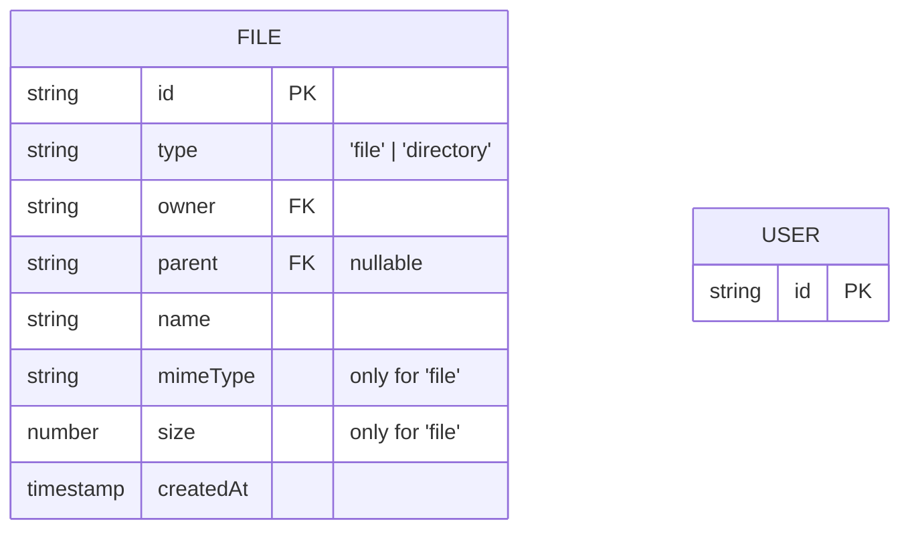
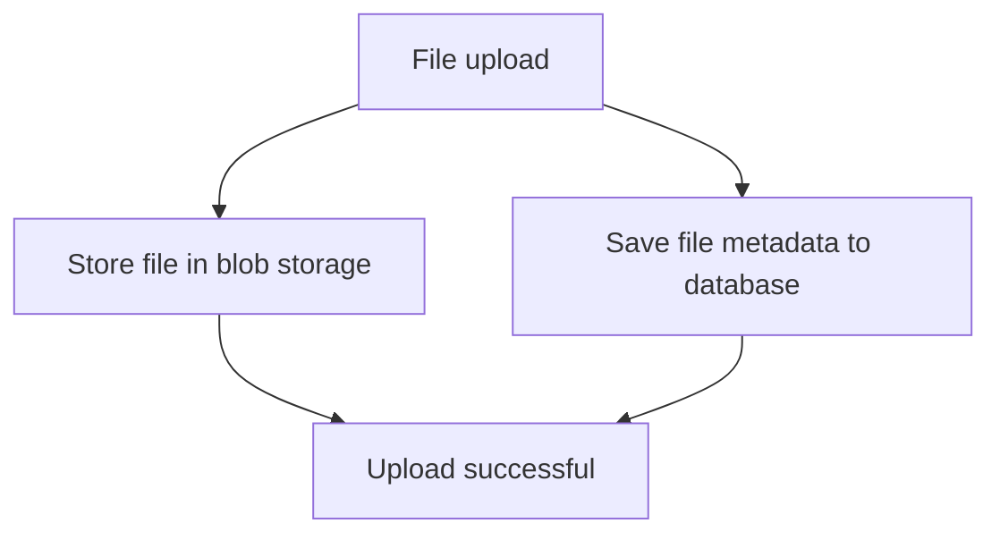
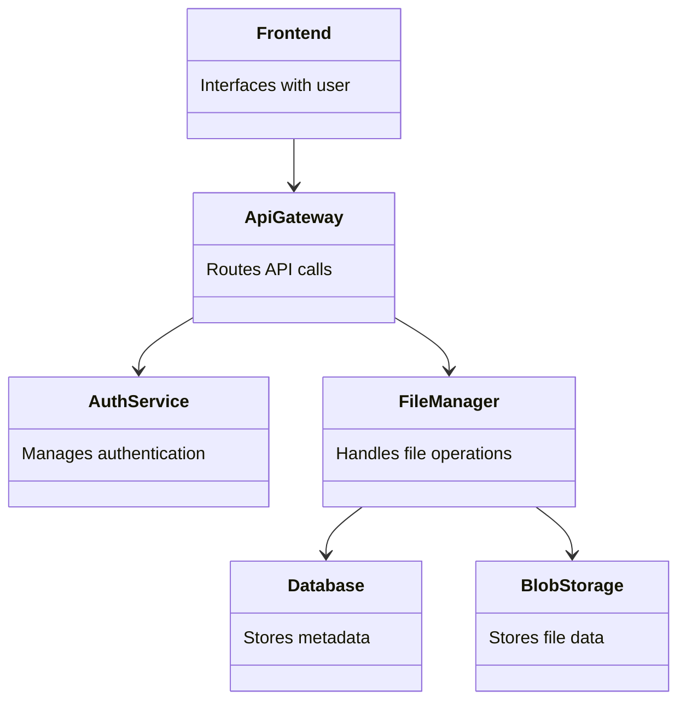
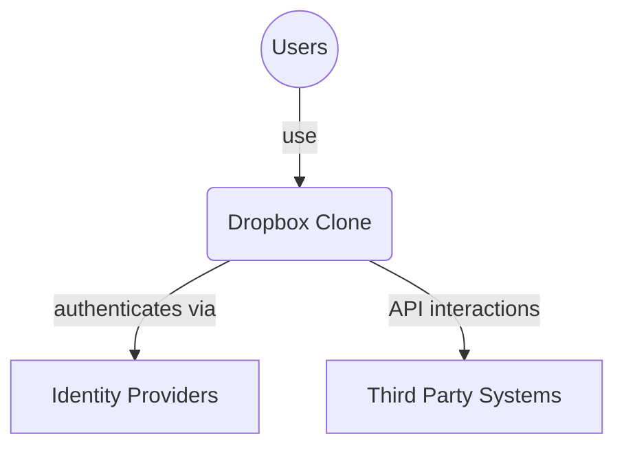
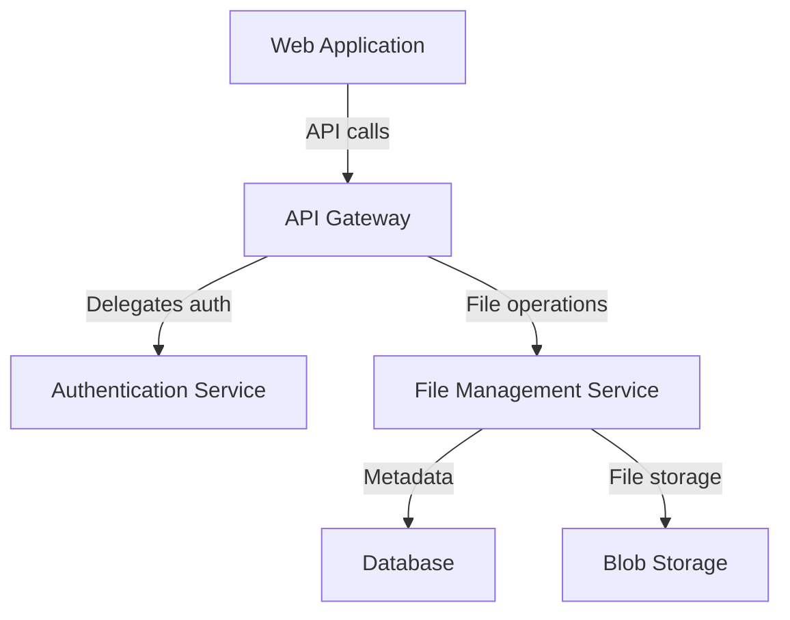

Below is a diagram illustrating the structure of the `FILE` collection in our database, where the `type` field can either be 'file' or 'directory'.

```mermaid
erDiagram
  FILE {
    string id PK
    string type "'file' | 'directory'"
    string owner FK
    string parent FK "nullable"
    string name
    string mimeType "only for 'file'"
    number size "only for 'file'"
    timestamp createdAt
  }
  USER {
    string id PK
  }
```

<!-- truncate -->

```mermaid
graph TD
  Upload[File upload]
  SaveMeta[Save file metadata to database]
  StoreBlob[Store file in blob storage]
  Success[Upload successful]

  Upload --> SaveMeta
  Upload --> StoreBlob
  StoreBlob --> Success
  SaveMeta --> Success
```

```mermaid
classDiagram
  class Frontend {
    Interfaces with user
  }
  class ApiGateway {
    Routes API calls
  }
  class AuthService {
    Manages authentication
  }
  class FileManager {
    Handles file operations
  }
  class Database {
    Stores metadata
  }
  class BlobStorage {
    Stores file data
  }

  Frontend --> ApiGateway
  ApiGateway --> AuthService
  ApiGateway --> FileManager
  FileManager --> Database
  FileManager --> BlobStorage
```

```mermaid
graph TD
  Users((Users))
  ThirdParty[Third Party Systems]
  DropboxClone(Dropbox Clone)
  IdentityProvider[Identity Providers]

  Users -->|use| DropboxClone
  DropboxClone -->|authenticates via| IdentityProvider
  DropboxClone -->|API interactions| ThirdParty
```

```mermaid
graph TD
  WebApp[Web Application]
  ApiGateway[API Gateway]
  AuthService[Authentication Service]
  FileManager[File Management Service]
  Database[Database]
  BlobStorage[Blob Storage]

  WebApp -->|API calls| ApiGateway
  ApiGateway -->|Delegates auth| AuthService
  ApiGateway -->|File operations| FileManager
  FileManager -->|Metadata| Database
  FileManager -->|File storage| BlobStorage
```
